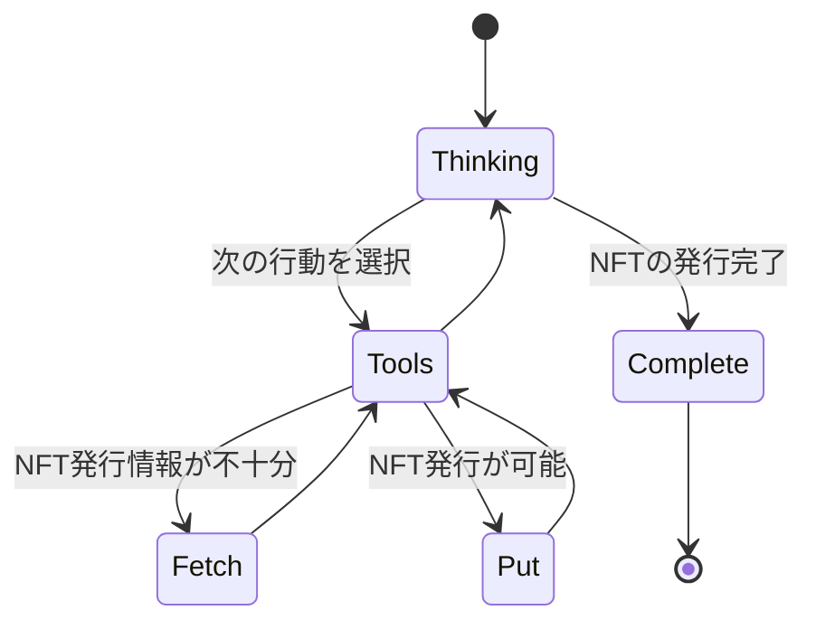

# contract-agent

コントラクトエージェントは、ブロックチェーン技術とAIを融合させた次世代の自律型エージェントである。

- スマートコントラクトの呼び出し: ブロックチェーン上に展開されたスマートコントラクトを直接操作・実行する能力を持ち、トラストレスな取引を自動化する。
- 取引の仲介と管理者代行: 従来は人間の管理者が担っていた取引の仲介業務を、AIエージェントが代行。透明性・効率性・セキュリティを高めながら、人的介入を最小限に抑える。

このようなエージェントは、DAO（分散型自律組織）やWeb3サービスにおいて、信頼性の高い意思決定と取引実行を支える重要なコンポーネントとなる。

## System architecture

コントラクトエージェントでは2つのサブエージェントとなるコンポーネントが存在する

1. **Thinking Agent**: 次の行動を選択するエージェント
2. **Tools Agent**: 呼び出すツールを選択して関数を呼び出すエージェント

2つのエージェント間は[contract_agent.py](/components/contract_agent.py)における`route`スタティックメソッドによる定義により遷移する。
これらの状態遷移は`State`に合わせて状態遷移が行われる。



以下はディレクトリ構成である

```bash
.
├── README.md
├── components
│   ├── __init__.py
│   ├── contract_agent.py: コントラクトエージェントのメインモジュール
│   └── model.py: クラスを定義
├── docs
├── main.py
├── requirements.txt
├── test
│   ├── __init__.py
│   ├── test_agent.py
│   └── test_tools.py
└── tools
    ├── __init__.py
    ├── contract.py: スマートコントラクトを呼び出すモジュール
    ├── ssdlab_token_abi.py: スマートコントラクトのABI
    └── tools.py: Agentが呼び出すツール一覧をリストで提供
```

## Thinking agent

Thinking agentは現在の状態（State）に基づいて次のアクションを決定する。

**Thinking agent処理の流れ**

1. 構造化された出力を生成するためのパーサーを設定
2. システムメッセージ(エージェントの役割や出力フォーマットの指示)を定義
3. 状態(State)に基づいて次のアクションを選択し入力内容を与える
    - put: NFTを発行する
    - fetch: 過去のNFT取引履歴を取得する
4. プロンプトを入力してモデルの実行
5. 状態(State)の更新と返却

## Tools agent

ブロックチェーンを呼び出し信用スコアの登録やSBTの取得をする。

1. リクエスト＋関数一覧の送信: リクエストには、実行可能なスマートコントラクト関数の一覧も含まれている
2. 呼び出す関数を予測して引数を返す: LangGraphベースのAgentが、LLMを活用してリクエスト内容を解析し、どの関数を呼び出すべきかを予測する
3. 関数の実行: 予測された関数と引数をもとに、Web3.pyを通じてスマートコントラクトを呼び出す
4. 実行結果の処理: スマートコントラクトから返された結果を受け取り、再びLLMがその内容を解釈・整形する
5. 処理結果の返却: 最終的に、整形された結果がユーザーまたは呼び出し元に返され、状態管理（State）にも記録される


## Getting started

以下のライブラリを事前にインストールして利用可能にする

- [pyenv](https://github.com/pyenv/pyenv): 複数のPythonバージョンを簡単に切り替えて管理する
- [venv](https://docs.python.org/3/library/venv.html): プロジェクトごとに独立したPython環境を作成する

リポジトリをクローンする

```bash
git clone https://github.com/C0A21130/contract-agent.git
```

`.env`ファイルをコピーし、内容を書き換える

- Azure OpenAIの設定
- langfuseの設定(任意)
- コントラクトアドレスやウォレットの秘密鍵の設定

```bash
cp .env.sample .env
```

Pythonのバージョンを変更する

```bash
pyenv install 3.12.10
pyenv local 3.12.10
```

仮想環境を作成しライブラリをインストールする

```bash
python -m venv .venv
source .venv/bin/activate
pip install -r requirements.txt
```

外部のブロックチェーンの起動とスマートコントラクトのデプロイをする

- Hardhatやgo-ethereumを活用するしてブロックチェーンの開発環境を用意する
- スマートコントラクトのデプロイはERC721に準拠するNFT(Non-Fungible Token)を取得・発行・転送を行う

Hardhatの例)

- [Web3-demo-app](https://github.com/C0A21130/web3-demo-app/blob/main/README.md#installation-steps)のInstallation Stepsを参照
- 別ターミナルでブロックチェーンのの起動とスマートコントラクトをデプロイをする必要がある
- ブロックチェーンの起動: `npx hardhat node`
- スマートコントラクトのデプロイ: `npx hardhat ignition deploy <デプロイ用のソースコード> --network localhost`

エージェントの実行

```bash
python main.py
```
